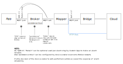

# Introduction
That document specifies alarm handling for thin-edge.

# Data Semantic of Alarms
Thin-edge treates alarms as **stateful signals**. Instead to usual **cyclic measured values** (as e.g. measurements of physical units like temperature, humidity, pressure, ...) a **stateful signal** is transfered only on state-change. If such a transfered state-change got lost, the cloud assumes the wrong state until a next state-change occurs. Especially in case of alarms that means a once raised alarm would completely unknown to the cloud.

A lost alam-raise could be even more problematic if the raised alarm requires some cloud-site interaction (or manual interaction). Since the lost alarm is not visible on cloud no intercation will be started. And since not state-change happen again, the alarm will never appear at cloud.

**Consequence:**<br/>
All alarm state-changes need to be transfered reliable from **Application to thin-edge**, and from **thin-edge to cloud**.
I.E. alarm state-changes must not got lost, or device software must be able to detect loss and react accordingly (e.g. retry to transfer).

# Information Set per Alarm
The specified alarm attributes below are inspired by cumulocity data model for alarms, but shall be re-usable for other clouds where possible.

| Name              | Description   |
| ----------------- |---------------|
| ref-string        | Device-unique reference string (kind of alarm ID or alarm name), used to reference the once occured alarm again, e.g. in case of updates (e.g. "temperature_sensor_loss") |
| message-string    | Human readable short information about alarm reason (e.g. "Temperature sensor does not respond") |
| severity-string   | Could be "CRITICAL", "MAJOR", "MINOR" or "WARNING" |
| status-string     | Could be "ACTIVE" or "CLEARED"<br/>
| time-string       | Timestamp indicating when the alarm (or the alarm-update) had occured (in [ISO 8601 format](http://www.w3.org/TR/NOTE-datetime#)) |

# Data flow

Figure below illustrates the data flow from Customer Application broker/thin-edge up to cloud. It shows especially the use of MQTT QOS=1, MQTT Retain and Mosquitto Persistence to achieve reliability alarm state-change transfer.



**To be decided:** Interface from Mapper to Cloud to be defined. Two options are possible:
1) **JSONviaMQTT:** To have reliability use QOS=1. Open issue: Not yet completely confirmed that C8Y sends PUBACK when msg was processed, instead just on arrival.
2) **HTTP REST:** HTTP response indicates if message was processed sucessfully. Anyway HTTP REST would increase complexity of implementation and increase data traffic.

## Requirements
|   |
|---------------|
| Thin-edge shall transfer most recent state of an alarm to the cloud. |
| Other local components (as local processes or connected clients) can consume alarm-states from thin-edge by subscribing local broker topics. The local consumer can be made to process full alarm-state history by using "QOS>0" in addition to "Retain". |
| The same alarm-state message shall be transfered just once to the cloud.<br/>An alarm-state message is treated as different when at least one field (see section 'Information Set per Alarm' above) in the message differs to the message before.<br/>Hint: Some mapper-specifics topic can be used (retained and persisted) to store messages that were already transfered to cloud (e.g. `mapper/c8y/ack/alarms/<alarm>`). |


# Public MQTT-based alarm interface

Similar to thin-edge'S measurement interface, alarm interface is based on MQTT topics.

## Topic structure and payload

Proposal to have "severity" and "ref-string" as topics:

**thin-edge JSON (alarm) format:**
```
Topic:   tedge/alarms/<device-id>/<severity-string>/<ref-string>
Payload: {
  "message":  <message-string>,
  "status":   <status-string>,  
  "time":     <time-string>
}
```

NOTE: The "device-id" indicates whether it is an alarm of the thin-edge device it-self (root-device) or a child-device. Use "root" for the thin-edge device or the child-device id for the according child-device.

Benefit to have "severity" and "ref-string" as topics:
Device-Site reactions to alarm could be easier relized.<br/>
Examples:
```
# Listen to all major alarms on all devices
tedge mqtt sub "tedge/alarms/+/major/+"

# Listen to specific alarm on all devices
# (e.g. a bunch of temperature sensors that have each an upper limit setpoint with alarm)
tedge mqtt sub "tedge/alarms/+/+/upper-limit-exceeded"

# And for sure all combinations.
```


Additionally an also supported "raw"-payload format will allow easy adoption for existing "MQTT publishers":

**Raw payload format:**
```
Topic:   tedge/alarms/<device-id>/<severity-string>/<ref-string>
Payload: <message-string>
```
In raw format for missing fields default values are used as below: 
   - "status" := "ACTIVE", if payload is not empty; "CLEARED", if payload empty
   - "time" := set to current local time when picked-up by mapper

Benefit to support "raw payload format":
In industrial area (e.g. PLCs) there often configurable MQTT publishersi. These pick-up some data-item (e.g. some process-datapoint, alarm, ...) and publish it's raw value to some configured MQTT topic. With "raw payload format" above, such MQTT publishers can use thin-edge alarm interface without coding/developing some component in between.


