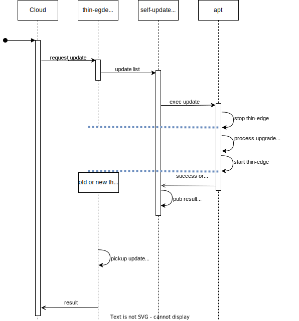

# Introduction

That document specifies the feature self-update for thin-edge.

The self-update allows a Cloud Operator to update one thin-edge version that is installed on a device to a newer version, via the Cloud connection. The feature is referred as self-update cause that update process is managed by thin-edge own's Software Management.

# Requirements

* Be default self-update shall use Debian Package Manager APT.
  * NOTE: APT Package Manager provides a very basic rollback mechanism that still can fail (e.g. due to some unexpected device state or power-loss).
* Device Owner shall be able to use a power-fail safe filesystem and transaction-safe package manager (instead of APT) - if the device support any.
  * Therefore an extensible plugin shall be provided.
* In thin-edge package's installation logic no external tools (e.g. grep, sed, ...) shall be used. Instead Rust code/libraries shall be used.
  * This is to reduce external dependencies and so reduce risc for failures due missing tools or wrong version of tools.

# Expected Pre-Conditions 

The device and it's thereon installed thin-edge has to follow precondition below to allow successful self-update:

1) The current (old) thin-edge on the device must be installed with usual thin-edge installation, or at leat as usual thin-edge installation would do. That is to assure new thin-edge version that is about to be installed has all external and internal files, folders and resources (e.g. config files) available.
2) Deployment of thin-edge and mosquitto must not be changed manually after initial installation (e.g. moving/renaming installed files, moving/renaming configuration files used by thin-edge, renaming users/groups created during installation, ...).

3) Package Dependencies need to be solved using SW Management before self-update. This is since self-update will disable auto-dep solving to reduce additional risk during self-update.

*Hint: Before executing self-update on devices in the field it shall be tested on a kind of golden device that equals the device(s) in the field in system-environment, configuration and thin-edge version.*

# Execution Flow and involved Components

# Design Principles

### Details about the SM Plugin

* A designated Software Management module type - namely "tedge" - will be used manage the self-update.

* The existing SM plugin "apt" will be used and extended to manage that module type "tedge". 
  * A device owner can implement an own plugin for module type "tedge", e.g. to use any other package manager than APT for self-update. 

* A softlink to be created in `/etc/tedge/sm-plugins/` named `tedge` that points to `apt` plugin, will make the SM agent aware.

* The plugin managing module type "tedge" must take all packages of an update request at once from SM Agent (i.E. Plugin API command "update-list" must be used). That is to get the plugin independent from potential restarts of the SM agent (those restarts are part of updating the SM agent).

* Before any package update for module type "tedge" starts, all needed installation resources for the entire update request must be downloaded (i.E. all \*.deb packages for APT). That is to get the plugin uncoupled from any potential network issue during update procedure.
  * For all packages with some URL given in the update request the SM Agent manages download before plugin start, and provides local file paths to the plugin. 
    TODO: What happens if one package download fails in SM agent? Does plugin maybe need to check if all files are locally available?
  * For all packages without any URL given in the update request the Package Manager (i.E. APT) will manage the download as part of the update. Therefor the plugin must instruct the package manager to first download **all** packages. 
    * If all packages were successfully downloaded, the package manager can start updating packages. 
    * Instead, if one or more download fails the plugin must stop before any installed package was touched by update, and report the entire update process as failed to the SM agent 

* After processing the complete update request the plugin will publish the overall exit code as MQTT retain message to topic `tedge/plugins/software/<plugin name>`, and exits.

* As both module types "tedge" and "apt" use same package manager APT, the plugin manages a blacklist to allow later to distinguish packages reported by Package Managers `apt list` command.
  * The blacklist is a TOML file that stores package names of all packages that were installed/updated with module type "tedge".
  * When the plugin manages an update request for a package with module type "tedge" it adds the package to the blacklist.
  * When the plugin manages an update request for a package with module type "apt" it removes the package from the blacklist.
  * When the plugin is called with LIST command for module type "apt", all non tedge packages (all installed but not blacklisted ones) will be reported.
  * When the plugin is called with LIST command for module type "tedge", all tedge packages (all installed and blacklisted ones) will be reported.

### Details about the SM Agent

* The SM agent must accept the final exit code of a plugin execution via MQTT retain message on topic `tedge/plugins/software/<plugin name>`, and send according update result message to the mapper.

* For module type "tedge" the SM Agent must consider that a restart of the agent is valid.
  * When the SM Agent flags an upcoming update request in the `persistance_store` before the request starts, it must store also the module type.
  * When the SM Agent starts and finds a flagged update request in the `persistance_store` that is just for module type "tedge", no failure must be reported to the cloud. 
    TODO: An update request that contains module type "tedge" and others shall be rejected by the SM Agent with an error message. See Options below.

# Options for more Robustness
NOTE: Options below to be decided and addressed in a 2nd drop.

### Robustness in Packages' installation logic
* Use of external tools (e.g. grep, sed, ...) shall be avoided in package's installation logic. Instead Rust code/libraries shall be used.
  * That is to reduce external dependencies and so reduce risc for failures.
* At very beginning of the installation/removal logic all required/touched external ressources (e.g. config files as "mosquitto.conf", external tools (if any left), ...) shall be checked for availibility/accessibility.
* If one external ressource is not available installation/removal procedure shall fail before any action was performed.

### Robustness in Self-Update processing
* When "tedge" plugin was started, no other update request for any other plugin must be in progress or started by the SM Agent.
  * Reason: APT will restart the SM Agent during upgrade, what would result into half-executed update procedures of other parallel running plugins and could lead to corrupted system behaviour.
  * It would be valid to execute any update requests for other plugins when tedge has completely finished. 
    It would be also valid to reject any other update request and report an error to Cloud while tedge update is running. 
* When executing APT the plugin will disable auto dependency solving.
  * This is to avoid installing more than the requested packages to reduce risc for potential failures.
* SM Agent shall fail when plugin for "tedge" does not support "update_list".
  * This is since an update request will fail when there is more than one package and the agent is concerned
* SM Agent shall fail when update request with packages for module type "tedge" contains also other module types.
