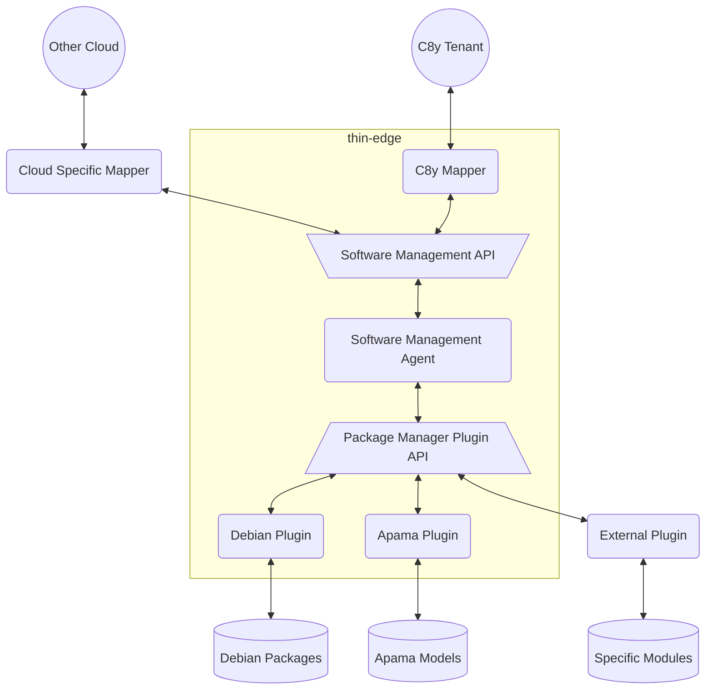
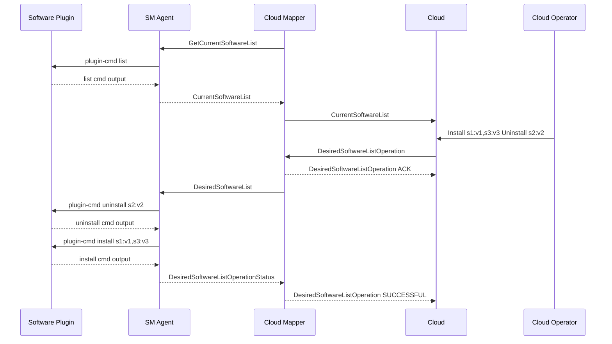

# Software management

With software management, a device operator specifies which software modules should run on the IoT devices of a fleet.

This functionality is split between the IoT platform and the device as follows:
* On the IoT platform, devices are grouped into fleets of devices,
  and the device owner specifies which software modules should run on the devices of each fleet.  
* On the device, the __software management agent__ ensures that the software modules running on the device
  are exactly those modules which have been specified in the IoT platform.

This document specifies the thin-edge __software management agent__,
* its interaction with the cloud
* its interaction with the package managers actually used to install the software modules,
* the way it can be extended to interact with different cloud providers,
* the way it can be extended to use different package managers.

## Overview

