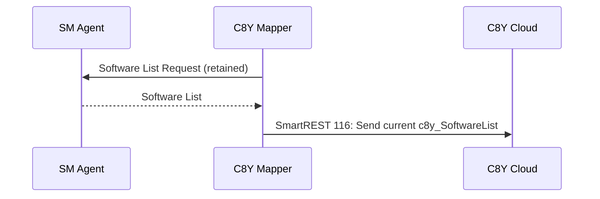
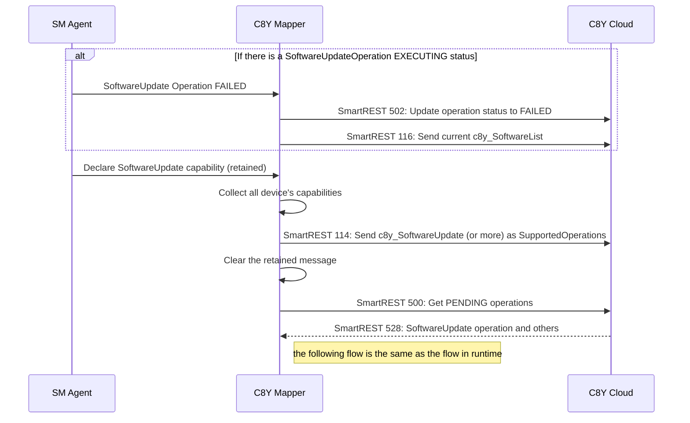
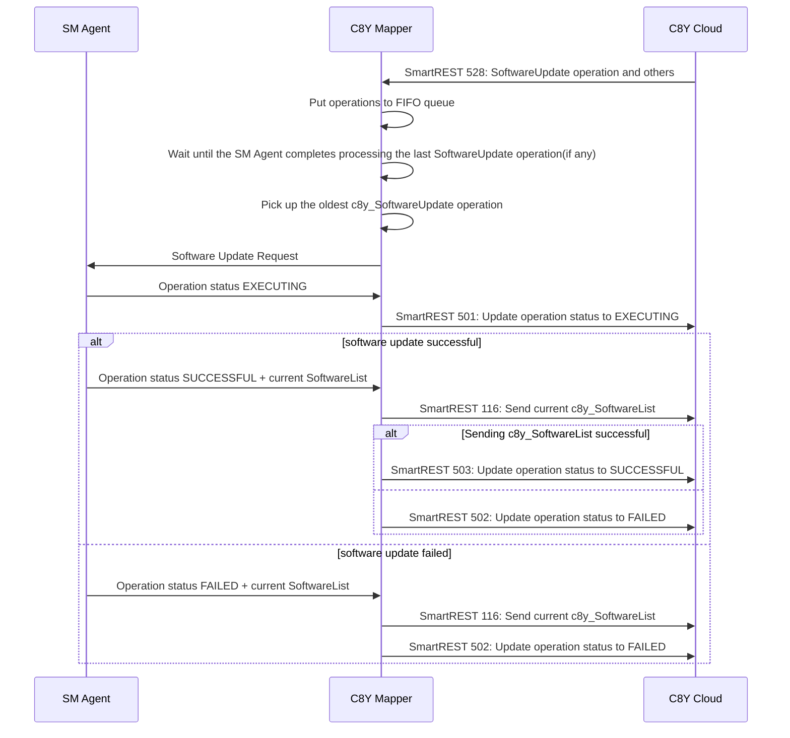

# C8Y Mapper Operation Handling

*!!ATTENTION!! We support only `c8y_SoftwareUpdate` in the release `0.3`. 
Ignore `c8y_DeviceProfile` for now.*

In this page, we focus on the contract between C8Y Mapper and C8Y Cloud. 
If you want to know the mapping rules, 
please refer to [Thin Edge JSON Mapping to/from C8Y](./thin-edge-json-mapping-to-from-c8y.md).

## Flow at C8Y Mapper Startup

|ID|Description|Example Payload|Type|
|---|---|---|---|
|[116](https://cumulocity.com/guides/device-sdk/mqtt/#a-name116set-software-list-116a)|Set software list|`116,software1,version1,url1,software2,version2,url2`|Publish|

Note:
- The Software List Request from c8y Mapper should set a retain flag. 
  In case that SM Agent is down when c8y Mapper starts up, 
  SM Agent can consume the request after SM Agent wakes up.

## Flow at SM Agent Startup

|ID|Description|Example Payload|Type|
|---|---|---|---|
|[502](https://cumulocity.com/guides/device-sdk/mqtt/#a-name502set-operation-to-failed-502a)|Set operation to FAILED|`502,c8y_SoftwareUpdate,"Permission denied"`|Publish|
|[116](https://cumulocity.com/guides/device-sdk/mqtt/#a-name116set-software-list-116a)|Set software list|`116,software1,version1,url1,software2,version2,url2`|Publish|
|[114](https://cumulocity.com/guides/device-sdk/mqtt/#a-name114set-supported-operations-114a)|Set supported operations|`114,c8y_SoftwareUpdate`|Publish|
|[500](https://cumulocity.com/guides/device-sdk/mqtt/#a-name500get-pending-operations-500a)|Get PENDING operations|`500`|Publish|
|[528](https://cumulocity.com/guides/device-sdk/mqtt/#a-name528update-software-528a)|Update Software|`528,external_id,software1,version1,url1,install,software2,version2,url2,delete`|Subscribe|

Note:
- Collecting all device's capabilities (e.g. SoftwareUpdate, Restart, etc.) are required 
  so that the mapper sends SmartREST `114` with all necessary supported operations.
- SM Agent might publish more capabilities than C8Y cloud supports. 
  In this case, the mapper doesn't need to subscribe the unsupported capability topics.
- `c8y_SoftwareUpdate` is supported in c8y version 10.7 and onwards.
- To clear the retained message, publish an empty payload with a retain flag on the topic.
- C8Y mapper can consider that the SM Agent is ready for a new operation 
  after the agent publishes device's capabilities.
- SmartREST `500` returns all the operations in the status `PENDING`.
- SmartREST `500` may return not only `528`.

## Flow in runtime phase for `c8y_SoftwareUpdate` operation

|ID|Description|Example Payload|Type|
|---|---|---|---|
|[528](https://cumulocity.com/guides/device-sdk/mqtt/#a-name528update-software-528a)|Update Software|`528,external_id,software1,version1,url1,install,software2,version2,url2,delete`|Subscribe|
|[501](https://cumulocity.com/guides/device-sdk/mqtt/#a-name501set-operation-to-executing-501a)|Set operation to EXECUTING|`501,c8y_SoftwareUpdate`|Publish|
|[116](https://cumulocity.com/guides/device-sdk/mqtt/#a-name116set-software-list-116a)|Set software list|`116,software1,version1,url1,software2,version2,url2`|Publish|
|[503](https://cumulocity.com/guides/device-sdk/mqtt/#a-name503set-operation-to-successful-503a)|Set operation to SUCCESSFUL|`503,c8y_SoftwareUpdate`|Publish|
|[502](https://cumulocity.com/guides/device-sdk/mqtt/#a-name502set-operation-to-failed-502a)|Set operation to FAILED|`502,c8y_SoftwareUpdate,"Permission denied"`|Publish|

Note:
- C8Y cloud might publish `c8y_SoftwareUpdate`(`528`) and also other operations.
- The mapper has responsibility to keep all received PENDING operations in FIFO queue.
- The mapper considers that SM Agent is ready for receiving a new operation 
  either **when it receives Operation status SUCCESSFUL/FAILED + current SoftwareList** 
  or **when it receives device capability (at agent startup only)**.
- SM Agent can process only one Software Update operation at one time. 
  Therefore, c8y Mapper should pick up the oldest c8y_SoftwareUpdate operation.
- C8Y UI blocks to create more than one `c8y_SoftwareUpdate` operation at the same time. 
  However, still user can create more than one operation from REST API.
- If one operation includes a couple of packages updates, and if one of those package failed, 
  we have to send `FAILED`.
