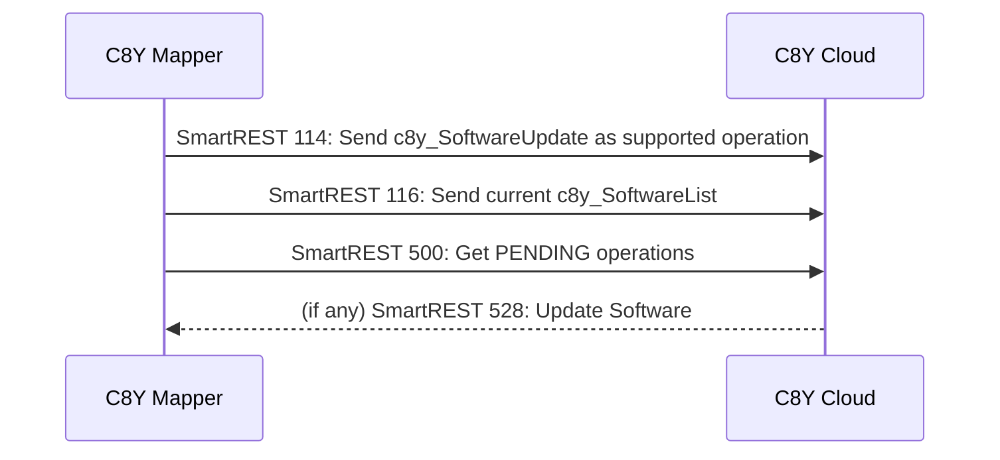
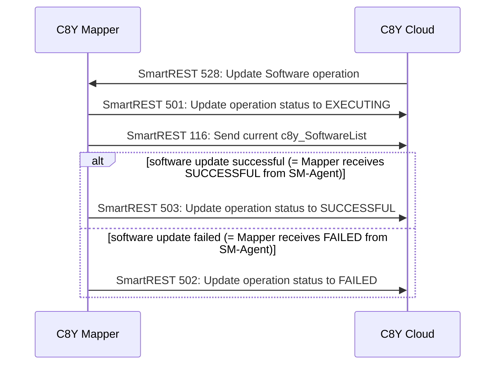

# Contract between Mapper and C8Y for 0.3

*!!ATTENTION!! We support `c8y_SoftwareUpdate` only in the release `0.3`.*

With SmartREST 2.0, the topic to publish: `s/us` and the topic to subscribe: `s/ds`.

## Flow at each agent start-up

Note:
- SmartREST `114` must contain all necessary supported operations. We can't send one by one.
- SmartREST `500` returns the all operations in the status `PENDING`.
- SmartREST `500` may return not only `528`. The mapper should ignore other numbers.
- `c8y_SoftwareUpdate` is supported in c8y version 10.7 and onwards.

Links and example message payloads:

|ID|Description|Example Payload|Type|
|---|---|---|---|
|[114](https://cumulocity.com/guides/device-sdk/mqtt/#a-name114set-supported-operations-114a)|Set supported operations|`114,c8y_SoftwareUpdate`|Publish|
|[116](https://cumulocity.com/guides/device-sdk/mqtt/#a-name116set-software-list-116a)|Set software list|`116,software1,version1,url1,software2,version2,url2`|Publish|
|[500](https://cumulocity.com/guides/device-sdk/mqtt/#a-name500get-pending-operations-500a)|Get PENDING operations|`500`|Publish|
|[528](https://cumulocity.com/guides/device-sdk/mqtt/#a-name528update-software-528a)|Update Software|`528,external_id,software1,version1,url1,install,software2,version2,url2,delete`|Subscribe|

## Flow in runtime phase for `c8y_SoftwareUpdate` operation

Note:
- User cannot create more than one `c8y_SoftwareUpdate` operation at the same time.
- If one operation includes couple of packages changes, and a package failed, we have to send `FAILED`.
- Thus, sending the current `c8y_SoftwareList` in the end of cycle is good regardless of `SUCCESSFUL`/`FAILED`.

Links and example message payloads:

|ID|Description|Example Payload|Type|
|---|---|---|---|
|[501](https://cumulocity.com/guides/device-sdk/mqtt/#a-name501set-operation-to-executing-501a)|Set operation to EXECUTING|`501,c8y_SoftwareUpdate`|Publish|
|[503](https://cumulocity.com/guides/device-sdk/mqtt/#a-name503set-operation-to-successful-503a)|Set operation to SUCCESSFUL|`500`|Publish|
|[502](https://cumulocity.com/guides/device-sdk/mqtt/#a-name502set-operation-to-failed-502a)|Set operation to FAILED|`502,c8y_SoftwareUpdate,"Permission denied"`|Publish|

Refer to [Flow at the start-up](#flow-at-each-agent-start-up) for `528` and `116`.
