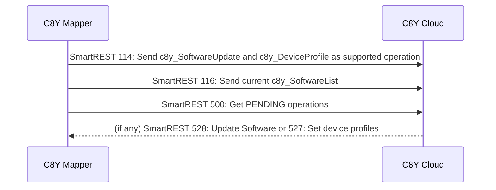
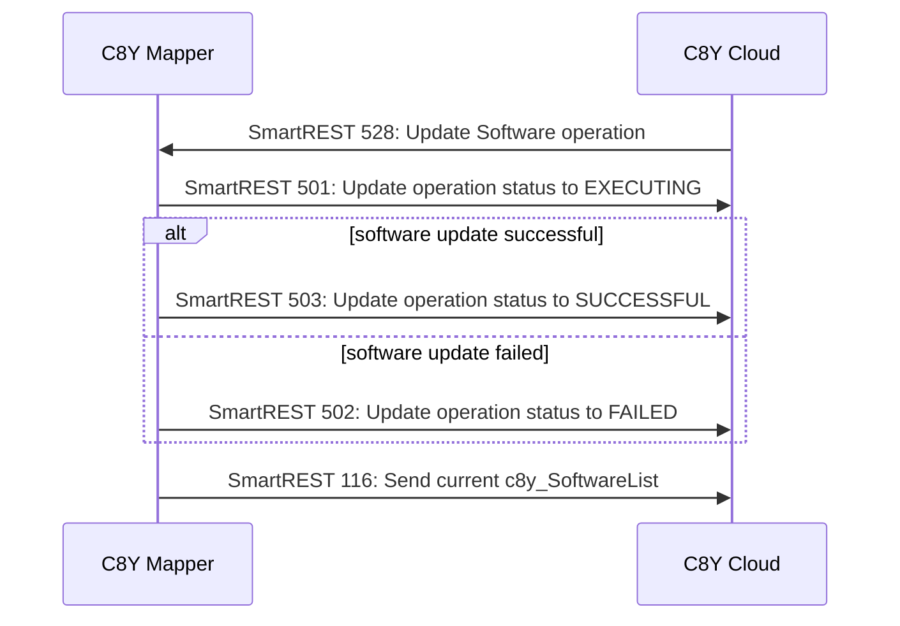
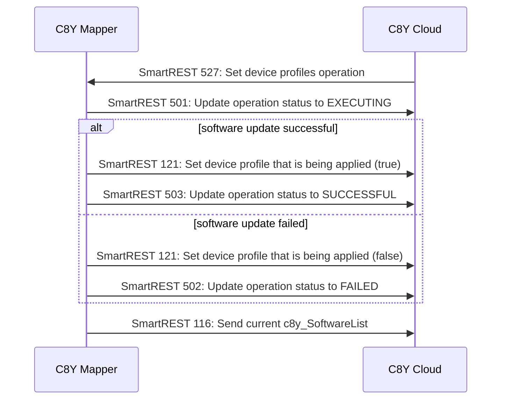

# Contract between Mapper and C8Y

## Flow at the start-up

Note:
- SmartREST `114` must contain all necessary supported operations. We can't send one by one.
- SmartREST `500` returns the all operations in the status `PENDING`.
- SmartREST `500` may return not only `527` or `528`. The mapper should ignore other numbers.
- `c8y_SoftwareUpdate` and `c8y_DeviceProfile` are supported in c8y version 10.7 and onwards.

## Flow in the cycle phase for `c8y_SoftwareUpdate` operation

Note:
- User cannot create more than one `c8y_SoftwareUpdate` operation at the same time.
- If one operation includes couple of packages changes, and a package failed, we have to send `FAILED`.
- Thus, sending the current `c8y_SoftwareList` in the end of cycle is good regardless of `SUCCESSFUL`/`FAILED`.

## Flow in the cycle phase for `c8y_DeviceProfile` operation

Note:
- SmartREST `121` must be sent when the operation status is `EXECUTING`.
- SmartREST `121` associates a device profile to a device. Only one device profile can be linked.
- User can create more than one `c8y_DeviceProfile` operations. In this case, SmartREST `501` to `503` applies to the oldest operation with type `c8y_DeviceProfile`.
- Therefore, mapper should address operations in FIFO.
