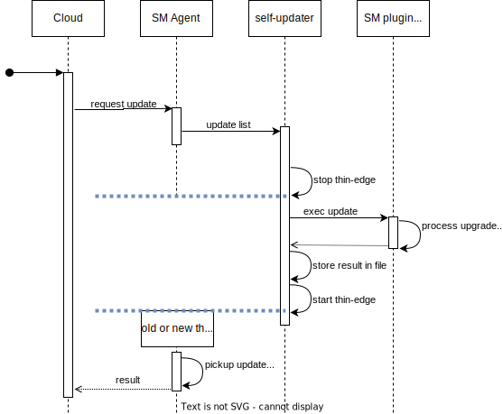

# Introduction


Thin-edge self-update allows a Cloud Operator to update one thin-edge version that is installed on a device to a newer version, via the Cloud connection. The feature is referred as self-update cause that update process is managed by thin-edge own's Software Management.

# Scope
  * The self-update makes use of usual thin-edge Software Management plugins (e.g. "APT"). It is as robust as the underlying package manager and filesystem (e.g. in case of power fail or installation failures).

  * Measures for more robusness:
    * A customer should use a transaction-safe package manager and powerfail-safe filesystem, if the device provides any.

    * There are plans for thin-edge packages to reduce risks for installation failures:
      1. Avoiding use of external tools in package installation logic (move from Shell scripts to Rust binary).
         See issue [#761](https://github.com/thin-edge/thin-edge.io/issues/761)
      2. Providing one thin-edge core package that contains everything needed for self-update (assumedly "Mapper", "SM Agent" and "SM Plugin"). 
         So self-update just needs that one-and-only package; all other thin-edge packages can be update via usual Software Management.
         See issue [TODO](TODO)

# Execution Flow and involved Components




# Design Principles

* Thin-edge updates are managed by a specific software component named tedge-self-updater (in following sections referenced as `self-updater`).

* The self-updater is an own executable that implements the plugin API's command `update-list` (nothing more from the plugin API).

* The SM Agent shall execute the self-updater instead of the SM plugin, for all thin-edge packages of an update request.

* The SM Agent uses a "tedge-package list" to determine whether a package is a thin-edge package or not.

* That "tedge-package list" holds all package-names that shall be managed by the self-updater. It shall allow to use regular expressions for package names.
     * Simple exmaple 1: `[ "tedge*" ]`
     * More fine grained exmaple 2: `[ "tedge_*", "tedge_agent_*", "tedge_apt_plugin_*" ]`


* That "tedge-package list" shall be runtime-extensible for a Customer (e.g. to add it's own mapper package). It could be part of some *.toml file.

* The self-updater delegates all actual package installation/removal actions to a usual SM plugin (e.g. the APT plugin), but manages both self-update specifics as below:

  (1) Stoping all thin-edge services (especially Agent and Mapper) before update, using `tedge disconnect` for all connected clouds.
      And also starting all service again after update using `tedge connect` for all connected clouds.<br/>
      NOTE: That is, since Agent and Mapper are obviously part of updated software.
      
  (2) Transfering of final result via a specific file to the Agent, instead of using the process exit-code.
      That final result code (referred as "exit status" in the plugin API spec) shall be stored as ASCII text in "/var/run/tedge_update/selfupdate-result".<br/>
      NOTE: That is, since due the restart of the SM Agent the Agent's process will be disconnected from plugin process and it's exit code.


  Sketch of the self-updater flow:
```
update_list() {
  for all clouds :
     tedge disconnect <cloud>
  
  # forward request to underlying SM plugin
  <plugin> update-list $*
  
  write_final_result_file
  
  for all clouds :
     tedge connect <cloud>
}
```

* A self-updatede shall be executed exclusively.
  * The SM Agent must reject any update request that contains packages that are part of the "tedge-package list", and packages that are not part of that list.
    If such a request appears the SM Agent shall report an error to the Cloud and shall create a log message.

* Handling of SM Agent restart:<br/>
  NOTE: Restart of SM Agent during self-update is valid, or even expected.

  * At the place (during startup) where SM Agent checks the `persistance_store` for any update request, it must avoid to send any error to the Cloud when the update request was processed by the self-updater.<br/>
  * The SM Agent shall check at startup for exitsence of the file "/var/run/tedge_update/selfupdate-result".
    * If that file exists it contains ASCII text that represents the final result code (referred as "exit status" in the plugin API spec) of the self-update.
    * The SM Agent shall send an according result message to the Cloud, and delete that file.

  * It might happen that the SM Agent does not restart and keeps connected to the self-updater (e.g. when the update fails). In that case the exit code of the self-updater process shall be used, and the file "/var/run/tedge_update/selfupdate-result" shall be removed, if exists.
