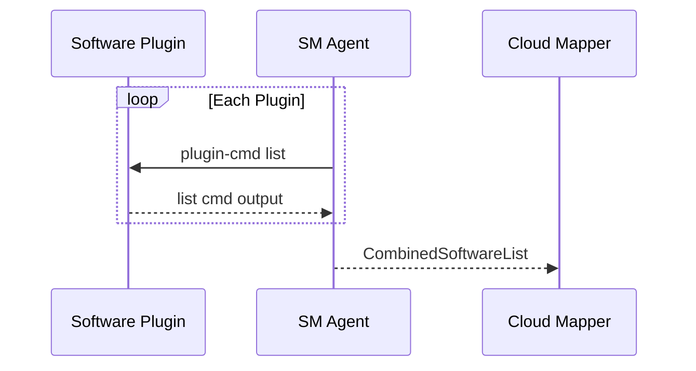
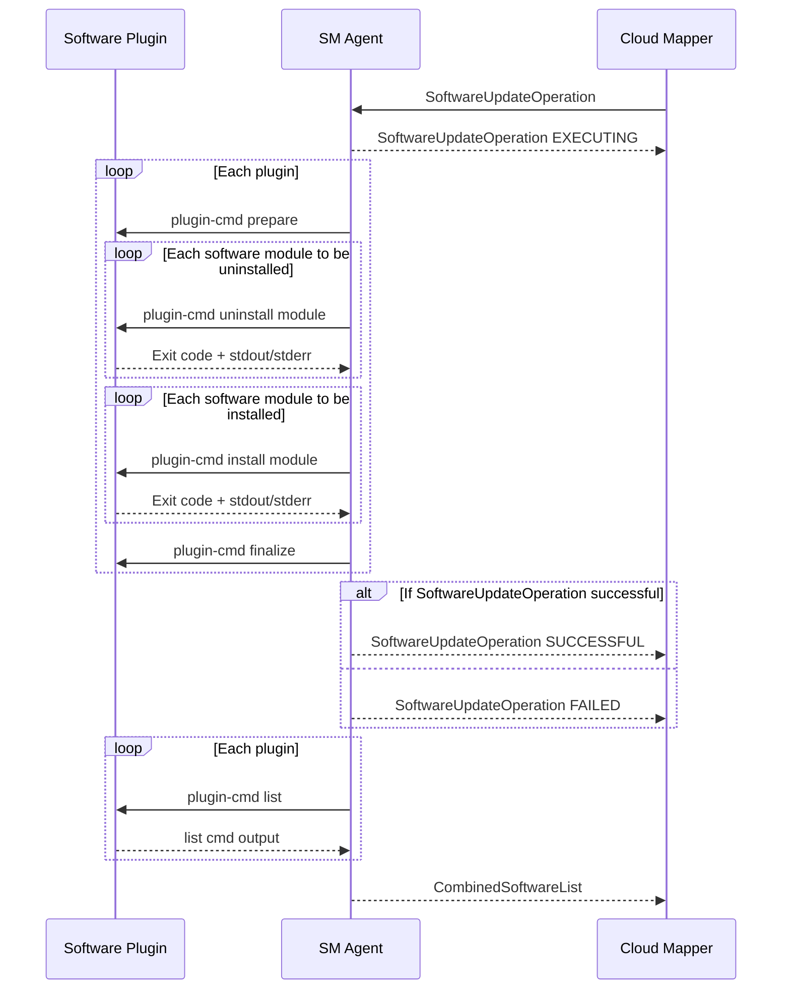

# SM Agent Startup

The sequence of operations and message exchanges happening on every startup of the sm-agent (initial startup on `tedge connect`, device restarts etc).



# SM Agent Runtime

The sequence of operations and message exchanges happening in the main execution loop of sm-agent while it's waiting for incoming software-update opearations and reacting to those received.




# Thin Edge JSON Software List

Topic to publish software list to: `tedge/software`

Payload format:

```json
{
    "software-list": [
        {
            "type": "debian",
            "list": [
                {
                    "name": "nodered",
                    "version": "1.0.0",
                },
                {
                    "name": "collectd",
                    "version": "5.7"
                }
            ]
        },
        {
            "type": "docker",
            "list": [
                {
                    "name": "nginx",
                    "version": "1.21.0",
                },
                {
                    "name": "mongodb",
                    "version": "4.4.6",
                }
            ]
        }
    ]
}
```

## Payload fields

In the top-level array, there will be one entry each for every plugin on the device, if the plugin reports a non-empty software list, when queries for one.

* **type** captures the type of software module that's being reported in the list, which is optional and can be empty for the default software module type of the device, if a default plugin is configured on the device.
* **list** is an array of software modules represented as JSON objects. This field is mandatory.
* **name** in the software module JSON captures the name of the software module, which is mandatory.
* **version** in the software module JSON captures the name of the software module, which is optional.

# Thin Edge JSON Software Update Operations

## Incoming Software Update Operation

Topic to subscribe to: `tedge/operation/software-update`

Payload format:

```json
{
    "software-update": [
        {
            "type": "debian",
            "list": [
                {
                    "name": "nodered",
                    "version": "1.0.0",
                    "action": "install"
                },
                {
                    "name": "collectd",
                    "version": "5.7",
                    "url": "https://collectd.org/download/collectd-tarballs/collectd-5.12.0.tar.bz2",
                    "action": "install"
                }
            ]
        },
        {
            "type": "docker",
            "list": [
                {
                    "name": "nginx",
                    "version": "1.21.0",
                    "action": "install"
                },
                {
                    "name": "mongodb",
                    "version": "4.4.6",
                    "action": "uninstall"
                }
            ]
        }
    ]
}
```

## Outgoing Software Update Operation Response

Once a software-update operation is received, it must be acknowledged with an EXECUTING response, followed by a SUCCESSFUL or FAILED response.

Topic to publish to: `tedge/operation-status/software-update`

### Executing Status Payload

```json
{
    "software-update-status": {
        "status": "EXECUTING"
    }
}
```

### Successful Status Payload

```json
{
    "software-update-status": {
        "status": "SUCCESSFUL"
    }
}
```

### Failed Status Payload

```json
{
    "software-update-status": {
        "status": "FAILED",
        "reason": "Partial failure",
        "details": [
            {
                "type": "debian",
                "list": [
                    {
                        "name": "nodered",
                        "version": "1.0.0",
                        "action": "install",
                        "status": "SUCCESSFUL"
                    },
                    {
                        "name": "collectd",
                        "version": "5.7",
                        "action": "install",
                        "status": "FAILED",
                        "reason": "Network timeout"
                    }
                ]
            },
            {
                "type": "docker",
                "list": [
                    {
                        "name": "nginx",
                        "version": "1.21.0",
                        "action": "install",
                        "status": "SUCCESSFUL"
                    },
                    {
                        "name": "mongodb",
                        "version": "4.4.6",
                        "action": "uninstall",
                        "status": "SUCCESSFUL"
                    }
                ]
            }
        ]
    }
}
```

The `reason` and `details` fields are completely optional.
