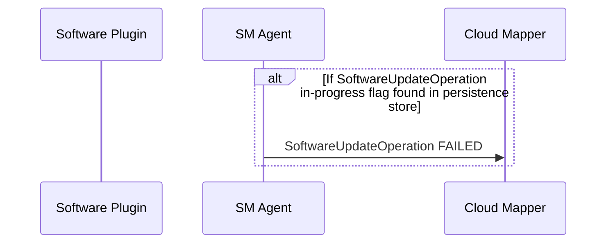
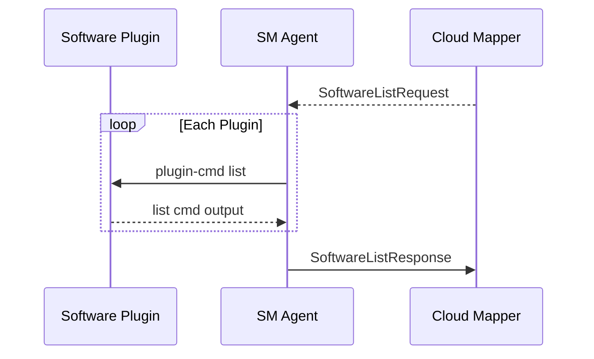
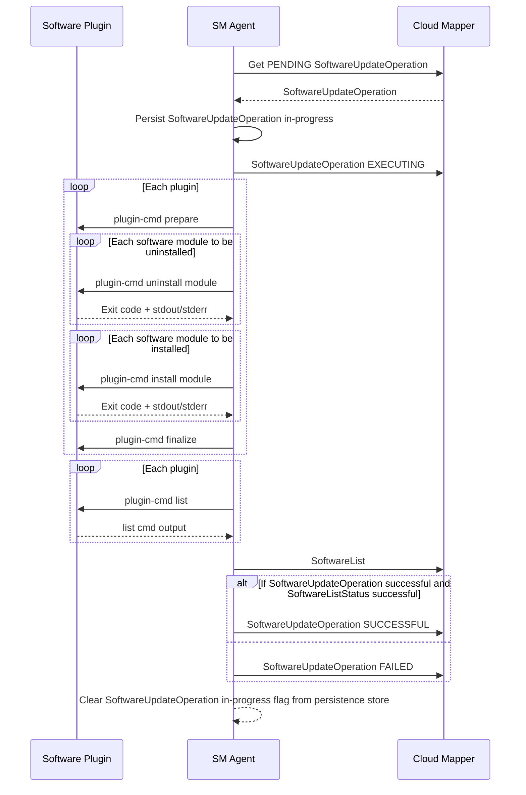

# SM Agent Startup

The sequence of operations and message exchanges happening on every startup of the sm-agent (initial startup on `tedge connect`, service restart, device restarts etc).



On every startup, sm-agent checks if a `SoftwareUpdateOperation` was in progress before the startup, from its persistent store. If yes, it means that the sm-agent crashed or the device got restarted while the update operation was in-progress. As long as we don't support resumption of software update operations, it's better to just mark the last operation failed so that the users can retry.

For now, persisting just a flag that the `SoftwareUpdateOperation` is in-progress is sufficient. Once we start supporting software update resumption after crashes/restarts, the entire software update list itself will have to be persisted and updated as the operation is being processed.

# SM Agent Runtime

The SM Agent needs to handle two kinds of requests from the cloud: software list request and software update request.

The sequence of operations on the receipt of a software list request is as follows:




The sequence of operations on the receipt of a software update request is as follows:




The SM Agent will process only one `SoftwareUpdateOperation` at a time.
If a duplicate operation is received while in the middle of processing one operation, the new request will be ignored.
Ignorning is okay as the SM Agent expects to retrieve it later on, after the current operation processing is complete, from the mapper via its PENDING requests queue.
The mapper can choose to persist such PENDING requests on its own if the cloud that it supports doesn't support such queueing.
But, the SM Agent won't persist such requests.


While processing the software update list, all the packages to be uninstalled are processed first,
before installing the ones to be installed as that offers a more predictable behaviour.

While installing/uinstalling the modules one by one, we have the option to either fail-fast as soon as one installation/uninstallation fails or keep track of the failures and continue installing/uninstalling the rest of the software modules.
Fail-fast would be a better choice as in the case of a failure, the user is more likely to retry that operation after making any changes to the original software update list that he prepared.

# Thin Edge JSON topic structures

A topic scheme like `tedge/inbound/<component>/<action>` is used for any inbound operation requests from the device to the cloud.
For the corresponding operation response need to be sent to `tedge/outbound/<component>/<action>`.

For example, the request to fetch the software list from the agent needs to be sent to `tedge/inbound/software/list` and the corresponding software list response will be sent to `tedge/outbound/software/list`.
Similar scheme can be used for other operations as well in future as captured in the following table:

| Operation          | Request Topic                     | Response Topic                     |
| ------------------ | --------------------------------- | ---------------------------------- |
| Software List      | `tedge/inbound/software/list`     | `tedge/outbound/software/list`     |
| Software Update    | `tedge/inbound/software/update`   | `tedge/outbound/software/update`   |
| Software List Sync | `tedge/inbound/software/sync`     | `tedge/outbound/software/sync`     |
| Update Profile     | `tedge/inbound/profile/update`    | `tedge/outbound/profile/update`    |
| Get Configuration  | `tedge/inbound/configuration/get` | `tedge/outbound/configuration/get` |
| Set Configuration  | `tedge/inbound/configuration/set` | `tedge/outbound/configuration/set` |
| Get Log            | `tedge/inbound/log/get`           | `tedge/outbound/log/get`           |
| Restart  device    | `tedge/inbound/device/restart`    | `tedge/outbound/device/restart`    |

# Software List Operation

## Thin Edge JSON Software List Request


Topic to publish the software list request to: `tedge/inbound/software/list`

Request payload: 

```json
{
    "id": 123
}
```

Some unique id must be generated by the requestor and this `id` is sent back in the response for correlation.

## Thin Edge JSON Software List Response

Topic to subscribe for the software list response: `tedge/outbound/software/list`

Payload format:

```json
{
    "id": 123,
    "status": "SUCCESSFUL",
    "list": [
        {
            "type": "debian",
            "list": [
                {
                    "name": "nodered",
                    "version": "1.0.0",
                },
                {
                    "name": "collectd",
                    "version": "5.7"
                }
            ]
        },
        {
            "type": "docker",
            "list": [
                {
                    "name": "nginx",
                    "version": "1.21.0",
                },
                {
                    "name": "mongodb",
                    "version": "4.4.6",
                }
            ]
        }
    ]
}
```

**Payload fields:**

In the top-level array, there will be one entry each for every plugin on the device, if the plugin reports a non-empty software list, when queried for one.

* `id` is used to correlate any response from the mapper while processing the software list. If the mapper fails to process the list, the error will published 
* `type` captures the type of software module that's being reported in the list, which is optional and can be empty for the default software module type of the device, if a default plugin is configured on the device.
* `list` is an array of software modules represented as JSON objects. This field is mandatory.
* `name` in the software module JSON captures the name of the software module, which is mandatory.
* `version` in the software module JSON captures the name of the software module, which is optional.

If fetching the software list had failed, the reponse would have indicated a failure as follows:

```json
{
    "id": 123,
    "status": "FAILED",
    "reason": "Request timed-out"
}
```

# Software Update Operation

## Thin Edge JSON Software Update Request

Topic to subscribe to: `tedge/inbound/software/update`

Payload format:

```json
{
    "software-update": [
        {
            "type": "debian",
            "list": [
                {
                    "name": "nodered",
                    "version": "1.0.0",
                    "action": "install"
                },
                {
                    "name": "collectd",
                    "version": "5.7",
                    "url": "https://collectd.org/download/collectd-tarballs/collectd-5.12.0.tar.bz2",
                    "action": "install"
                }
            ]
        },
        {
            "type": "docker",
            "list": [
                {
                    "name": "nginx",
                    "version": "1.21.0",
                    "action": "install"
                },
                {
                    "name": "mongodb",
                    "version": "4.4.6",
                    "action": "uninstall"
                }
            ]
        }
    ]
}
```

**Why there's no `id` in the request to distinguish one SW update request from another?**
  
Currently we only support one software update operation at a time.
If a duplicate operation is received while in the middle of processing another operation, the new request will be ignored.
Ignorning is okay as that ignored operation will still be present in the PENDING requests queue and can be retrieved back after the current operation processing is complete.
Since there's always only request that's under process, every reponse is assumed to be for the last request that was sent.

## Thin Edge JSON Software Update Response

Once a software-update operation is received, it must be acknowledged with an EXECUTING response, followed by a SUCCESSFUL or FAILED response.

Topic to subscribe for the software update response: `tedge/outbound/software/update`

### Executing Status Payload

```json
{
    "status": "EXECUTING"
}
```

### Successful Status Payload

```json
{
    "status": "SUCCESSFUL",
    "current-software-list": [
        {
            "type": "debian",
            "list": [
                {
                    "name": "nodered",
                    "version": "1.0.0",
                },
                {
                    "name": "collectd",
                    "version": "5.7"
                }
            ]
        },
        {
            "type": "docker",
            "list": [
                {
                    "name": "nginx",
                    "version": "1.21.0",
                },
                {
                    "name": "mongodb",
                    "version": "4.4.6",
                }
            ]
        }
    ]
}
```

Sending the current software list along with the status will help the cloud providers to show the most up-to-date software list after an update was performed, which would include any extra depepndencies that got installed/removed as part of the update.

### Failed Status Payload

```json
{
    "status":"FAILED",
    "reason":"Partial failure: Couldn't install collectd and nginx",
    "current-software-list": [
        {
            "type": "debian",
            "list": [
                {
                    "name": "nodered",
                    "version": "1.0.0",
                }
            ]
        },
        {
            "type": "docker",
            "list": [
                {
                    "name": "mongodb",
                    "version": "4.4.6",
                }
            ]
        }
    ]
}
```

Sending the current software list along with the status even in the case of a failure will help the cloud providers to show the most up-to-date software list, especially in the case of partial failures, which would contain the modules and dependencies that got installed, even though the overall update failed.

# FAQs on design choices

**Q:** Why have dedicated topics for each operation like `tedge/operations/software-update` and `tedge/operations-status/software-update`? Why not just use a single topic like `tedge/operations` and keep the operation type in the TEdge JSON payload in a `type` field or something like that?

**A:** Having dedicated topics would be easier if different operations are handled by different Thin Edge components like `sm-agent` handling software update operations, a `fw-agent` handling firmware update operations etc. Each component can have dedicated request response topics and just deal with the request/responses for that component. Keeping a single topic with the operation `type` in the payload will force every component to read every operation message and filter only the ones that are meant for them. But, if we plan to have a single component process all the operations, having a single topic might be okay. But even in such a scenario, we could have dedicated topics like `tedge/operations/software-update` and `tedge/operations/firmware-update` and have that operations-agent subscribe to `tedge/operations/+` and derive the operation type from the last topic level.

