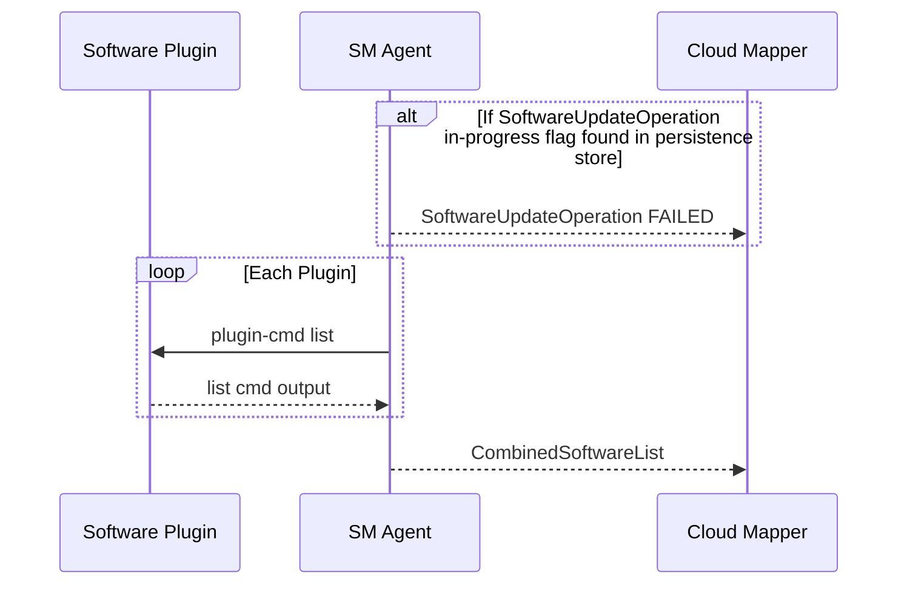
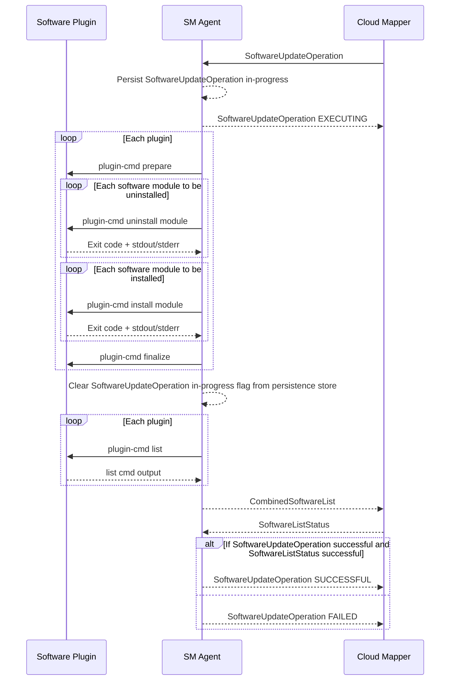

# SM Agent Startup

The sequence of operations and message exchanges happening on every startup of the sm-agent (initial startup on `tedge connect`, service restart, device restarts etc).



On every startup, sm-agent checks if a `SoftwareUpdateOperation` was in progress before the startup, from its persistent store. If yes, it means that the sm-agent crashed or the device got restarted while the update operation was in-progress. As long as we don't support resumption of software update operations, it's better to just mark the last operation failed so that the users can retry.

For now, persisting just a flag that the `SoftwareUpdateOperation` is in-progress is sufficient. Once we start supporting software update resumption after crashes/restarts, the entire software update list itself will have to be persisted and updated as the operation is being processed.

# SM Agent Runtime

The sequence of operations and message exchanges happening in the main execution loop of sm-agent while it's waiting for incoming software-update opearations and reacting to those received.




The software list is sent before marking the operation itself `SUCCESSFUL` or `FAILED` is necessary, because otherwise the cloud wouldn't know what the updated software list is. If the software list is published after marking the operation successful, and if sending the list fails, the cloud will show that the software update operation succeeded, but will continue showing the old software list which is obsolete.

# Thin Edge JSON Software List

Topic to publish software list to: `tedge/software-list`

Payload format:

```json
{
    "id": 123,
    "software-list": [
        {
            "type": "debian",
            "list": [
                {
                    "name": "nodered",
                    "version": "1.0.0",
                },
                {
                    "name": "collectd",
                    "version": "5.7"
                }
            ]
        },
        {
            "type": "docker",
            "list": [
                {
                    "name": "nginx",
                    "version": "1.21.0",
                },
                {
                    "name": "mongodb",
                    "version": "4.4.6",
                }
            ]
        }
    ]
}
```

## Payload fields

In the top-level array, there will be one entry each for every plugin on the device, if the plugin reports a non-empty software list, when queried for one.

* `id` is used to correlate any response from the mapper while processing the software list. If the mapper fails to process the list, the error will published 
* `type` captures the type of software module that's being reported in the list, which is optional and can be empty for the default software module type of the device, if a default plugin is configured on the device.
* `list` is an array of software modules represented as JSON objects. This field is mandatory.
* `name` in the software module JSON captures the name of the software module, which is mandatory.
* `version` in the software module JSON captures the name of the software module, which is optional.

## Software list response

When the mapper receives software list, it needs to confirm that the list could be successfully forwarded to the cloud. If it fails to do so, an error must be reported back as well. Such responses from the mapper should be published to `tedge/software-list-status` in the following format:

```json
{
    "id": 123,
    "status": "FAILED",
    "reason": "List too long"
}
```

* `id` must be the same id that was sent in the software list message. It is mandatory.
* `status` "SUCCESSFUL" means the software list was successfully processed by the mapper. "FAILED" indicates otherwise. This field is mandatory.
* `reason` can describe in detail, the cause of the failure. It is an optional field.


# Thin Edge JSON Software Update Operations

The software update operations received from the cloud and the corresponding responses to be sent by the sm-agent are captured below.

## Incoming Software Update Operation

Topic to subscribe to: `tedge/operations/software-update`

Payload format:

```json
{
    "software-update": [
        {
            "type": "debian",
            "list": [
                {
                    "name": "nodered",
                    "version": "1.0.0",
                    "action": "install"
                },
                {
                    "name": "collectd",
                    "version": "5.7",
                    "url": "https://collectd.org/download/collectd-tarballs/collectd-5.12.0.tar.bz2",
                    "action": "install"
                }
            ]
        },
        {
            "type": "docker",
            "list": [
                {
                    "name": "nginx",
                    "version": "1.21.0",
                    "action": "install"
                },
                {
                    "name": "mongodb",
                    "version": "4.4.6",
                    "action": "uninstall"
                }
            ]
        }
    ]
}
```

**Why there's no `id` in the request to distinguish one SW update request from another?**
  
Currently we only support one software update operation at a time as Cumulocity only allows one software update operation to be sent from the cloud at a time. Users can't send another one until the last one either succeeds or fails. Since there are no concurrent opeartions possible, Cumulocity doesn't need an `id` and hence they don't send one in the requests either. Once Cumulocity supports concurrent software update operations or once we support another cloud that supports concurrent software update operations, we can introduce the `id` field.

## Outgoing Software Update Operation Response

Once a software-update operation is received, it must be acknowledged with an EXECUTING response, followed by a SUCCESSFUL or FAILED response.

Topic to publish to: `tedge/operations-status/software-update`

### Executing Status Payload

```json
{
    "software-update-status": "EXECUTING"
}
```

### Successful Status Payload

```json
{
    "software-update-status": "SUCCESSFUL"
}
```

### Failed Status Payload

```json
{
    "software-update-status":"FAILED",
    "reason":"Partial failure",
    "details":[
        {
            "type":"debian",
            "list":[
                {
                    "name":"nodered",
                    "version":"1.0.0",
                    "action":"install",
                    "status":"SUCCESSFUL"
                },
                {
                    "name":"collectd",
                    "version":"5.7",
                    "action":"install",
                    "status":"FAILED",
                    "reason":"Network timeout"
                }
            ]
        },
        {
            "type":"docker",
            "list":[
                {
                    "name":"nginx",
                    "version":"1.21.0",
                    "action":"install",
                    "status":"SUCCESSFUL"
                },
                {
                    "name":"mongodb",
                    "version":"4.4.6",
                    "action":"uninstall",
                    "status":"SUCCESSFUL"
                }
            ]
        }
    ]
}
```

The `reason` and `details` fields are completely optional. The `details` field could even be dropped for initial release.

# FAQs on design choices

**Q:** Why have dedicated topics for each operation like `tedge/operations/software-update` and `tedge/operations-status/software-update`? Why not just use a single topic like `tedge/operations` and keep the operation type in the TEdge JSON payload in a `type` field or something like that?

**A:** Having dedicated topics would be easier if different operations are handled by different Thin Edge components like `sm-agent` handling software update operations, a `fw-agent` handling firmware update operations etc. Each component can have dedicated request response topics and just deal with the request/responses for that component. Keeping a single topic with the operation `type` in the payload will force every component to read every operation message and filter only the ones that are meant for them. But, if we plan to have a single component process all the operations, having a single topic might be okay. But even in such a scenario, we could have dedicated topics like `tedge/operations/software-update` and `tedge/operations/firmware-update` and have that operations-agent subscribe to `tedge/operations/+` and derive the operation type from the last topic level.

