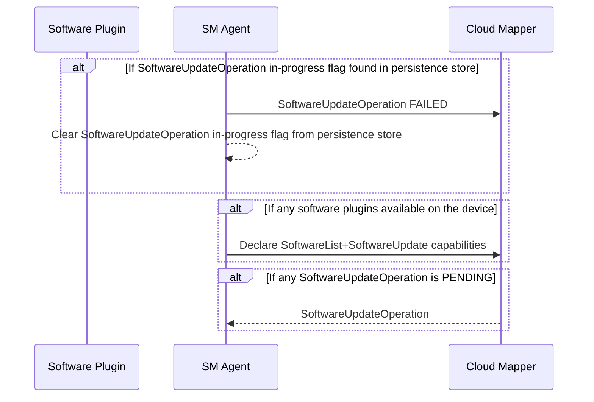

# Software Management Agent

The software management agent (referred to as `SM Agent` in the rest of this document) is the component that's responsible for the software management operations on a Thin Edge device.
It primarily interacts with a `Cloud Mapper` and a `Software Plugin` backed by a software package manager (apt, snap, docker etc).

The `Cloud Mapper` is the process that's responsible for cloud message mapping as well as other cloud-specific processing logic.
The `Cloud Mapper`'s behaviour handling of software management requests/response are describe in detail here[../c8y-mapper-operation-handling.md]

The `Software Plugin` handles the installation/removal of software modules with the help of package manager, when called by the `SM Agent`.
The `Software Plugin` specification is captured in detail here[../plugin-api.md]
# SM Agent Startup

The sequence of operations and message exchanges happening on every startup of the sm-agent (initial startup on `tedge connect`, service restart, device restarts etc).




On every startup, sm-agent checks if a `SoftwareUpdateOperation` was in progress before the startup, from its persistent store.
If yes, it means that the sm-agent crashed or the device got restarted while the update operation was in-progress.
As long as we don't support resumption of software update operations, it's better to just mark the last operation failed so that the users can retry.

For now, persisting just a flag that the `SoftwareUpdateOperation` is in-progress is sufficient.
Once we start supporting software update resumption after crashes/restarts, the entire software update list itself will have to be persisted and updated as the operation is being processed.

On startup, the agent also prompts the mapper to send any PENDING operation that it may have received while the agent was not up.
The mapper will respond back with a `SoftwareUpdateOperation` if any were received and PENDING.

# SM Agent Runtime

The SM Agent needs to handle two kinds of requests from the cloud: software list request and software update request.

The sequence of operations on the receipt of a software list request is as follows:


The sequence of operations on the receipt of a software update request is as follows:


The SM Agent will process only one `SoftwareUpdateOperation` at a time.
If a duplicate operation is received while in the middle of processing one operation, the new request will be ignored.
Ignoring is okay as the SM Agent expects to retrieve it later on, after the current operation processing is complete, from the mapper via its PENDING requests queue.
The mapper can choose to persist such PENDING requests on its own if the cloud that it supports doesn't support such queueing.
But, the SM Agent won't persist such requests.

While processing the software update list, the module are installed/uninstalled in the order that they were received from the cloud.

While installing/uinstalling the modules one by one, we have the option to either fail-fast as soon as one installation/uninstallation fails or keep track of the failures and continue installing/uninstalling the rest of the software modules.
Fail-fast would be a better choice as in the case of a failure, the user is more likely to retry that operation after making any changes to the original software update list that he prepared.

Once the mapper receives the SUCCESSFUL or FAILED status for an update operation from the SM Agent,
it can send the next PENDING `SoftwareUpdateOperation` to the SM Agent and the whole request processing cycle will repeat.

# Thin Edge JSON Specification for Commands

A topic scheme like `tedge/commands/req/<component>/<action>` is used for inbound operation requests.
The corresponding operation response need to be sent to `tedge/commands/res/<component>/<action>`.
In the future we can add sub actions as well, as in `tedge/commands/req/<component>/<action>/<sub-action>` 
or even more levels in the topic hierarchy, if needed.

For example, the request to fetch the software list from the agent needs to be sent to `tedge/commands/req/software/list` and the corresponding software list response will be sent to `tedge/commands/res/software/list`.
Similar scheme can be used for other operations as well in future as captured in the following table:

| Operation          | Request Topic                          | Response Topic                         |
| ------------------ | -------------------------------------- | -------------------------------------- |
| Get Software List  | `tedge/commands/req/software/list`     | `tedge/commands/res/software/list`     |
| Software Update    | `tedge/commands/req/software/update`   | `tedge/commands/res/software/update`   |
| Sync Software List | `tedge/commands/req/software/sync`     | `tedge/commands/res/software/sync`     |
| Apply Profile      | `tedge/commands/req/profile/apply`     | `tedge/commands/res/profile/apply`     |
| Get Configuration  | `tedge/commands/req/configuration/get` | `tedge/commands/res/configuration/get` |
| Set Configuration  | `tedge/commands/req/configuration/set` | `tedge/commands/res/configuration/set` |
| Get Log            | `tedge/commands/req/log/get`           | `tedge/commands/res/log/get`           |
| Restart  device    | `tedge/commands/req/control/restart`   | `tedge/commands/res/control/restart`   |
| Remote  connect    | `tedge/commands/req/control/connect`   | `tedge/commands/res/control/connect`   |

Having such dedicated topics for each command enables Thin Edge components to selectively subscribe to only the commands that they're interested in.
If one component wants to subscribe to all commands for a single component like `software`, it can still subscribe to `tedge/commands/req/software/#`.
If one component wants to subscribe to all commands, then it can even subscribe to `tedge/commands/req/#`.

## Ordering of operations along multiple topics

Since MQTT doesn't guarantee ordered delivery of messages across different topics, the ordering of actions for a single component,
or even the ordering of actions between different components will have to be controlled by the publisher, which is the `Cloud Mapper`.
When strict ordering is required between commands, like a software update command followed by a device restart command,
the `Cloud Mapper` needs to issue the software update request first, wait for its response and only then issue the device restart request.
It can also send unordered commands like a log request or remote control parallelly, even when some other ordered commands are being executed.

# Thin Edge JSON Specification for Software Management Commands
## Declaring Capabilities

Topics to publish the request to:
* For software update: `tedge/capabilities/software/update`
* For software list: `tedge/capabilities/software/list`
* For software sync: `tedge/capabilities/software/sync`

There's no payload to send.

The mapper, on receipt of this request will publish any PENDING operations of that kind to the designated topics like `tedge/commands/req/software/list`, `tedge/commands/req/configuration/set` etc.
If there are no PENDING operations of that kind, then mapper won't send any response.

## Software List Operation

### Thin Edge JSON Software List Request


Topic to publish the software list request to: `tedge/commands/req/software/list`

Request payload: 

```json
{
    "id": 123
}
```

Some unique id must be generated by the requestor and this `id` is sent back in the response for correlation.

### Thin Edge JSON Software List Response

Topic to subscribe for the software list response: `tedge/commands/res/software/list`

Payload format:

```json
{
    "id": 123,
    "status": "SUCCESSFUL",
    "list": [
        {
            "type": "debian",
            "list": [
                {
                    "name": "nodered",
                    "version": "1.0.0",
                },
                {
                    "name": "collectd",
                    "version": "5.7"
                }
            ]
        },
        {
            "type": "docker",
            "list": [
                {
                    "name": "nginx",
                    "version": "1.21.0",
                },
                {
                    "name": "mongodb",
                    "version": "4.4.6",
                }
            ]
        }
    ]
}
```

**Payload fields:**

In the top-level array, there will be one entry each for every plugin on the device, if the plugin reports a non-empty software list, when queried for one.

* `id` is used to correlate any response from the mapper while processing the software list. If the mapper fails to process the list, the error will published 
* `type` captures the type of software module that's being reported in the list.
  It will be the name of the plugin that reports this list.
  It can be optional and can be empty for the default software module type of the device, if a default plugin is configured on the device.
* `list` is an array of software modules represented as JSON objects. This field is mandatory.
* `name` in the software module JSON captures the name of the software module, which is mandatory.
* `version` in the software module JSON captures the name of the software module, which is optional.

If fetching the software list had failed, the reponse would have indicated a failure as follows:

```json
{
    "id": 123,
    "status": "FAILED",
    "reason": "Request timed-out"
}
```

## Software Update Operation

### Thin Edge JSON Software Update Request

Topic to subscribe to: `tedge/commands/req/software/update`

Payload format:

```json
{
    "id": 123,
    "software-update": [
        {
            "type": "debian",
            "list": [
                {
                    "name": "nodered",
                    "version": "1.0.0",
                    "action": "install"
                },
                {
                    "name": "collectd",
                    "version": "5.7",
                    "url": "https://collectd.org/download/collectd-tarballs/collectd-5.12.0.tar.bz2",
                    "action": "install"
                }
            ]
        },
        {
            "type": "docker",
            "list": [
                {
                    "name": "nginx",
                    "version": "1.21.0",
                    "action": "install"
                },
                {
                    "name": "mongodb",
                    "version": "4.4.6",
                    "action": "remove"
                }
            ]
        }
    ]
}
```

### Thin Edge JSON Software Update Response

Once a software-update operation is received, it must be acknowledged with an EXECUTING response, followed by a SUCCESSFUL or FAILED response.

Topic to subscribe for the software update response: `tedge/commands/res/software/update`

#### Executing Status Payload

```json
{
    "status": "EXECUTING"
}
```

#### Successful Status Payload

```json
{
    "status": "SUCCESSFUL",
    "current-software-list": [
        {
            "type": "debian",
            "list": [
                {
                    "name": "nodered",
                    "version": "1.0.0",
                },
                {
                    "name": "collectd",
                    "version": "5.7"
                }
            ]
        },
        {
            "type": "docker",
            "list": [
                {
                    "name": "nginx",
                    "version": "1.21.0",
                },
                {
                    "name": "mongodb",
                    "version": "4.4.6",
                }
            ]
        }
    ]
}
```

Sending the current software list along with the status will help the cloud providers to show the most up-to-date software list after an update was performed, which would include any extra depepndencies that got installed/removed as part of the update.

#### Failed Status Payload

```json
{
    "status":"FAILED",
    "reason":"Partial failure: Couldn't install collectd and nginx",
    "current-software-list": [
        {
            "type": "debian",
            "list": [
                {
                    "name": "nodered",
                    "version": "1.0.0",
                }
            ]
        },
        {
            "type": "docker",
            "list": [
                {
                    "name": "nginx",
                    "version": "1.21.0",
                }
            ]
        }
    ],
    "failures":[
        {
            "type":"debian",
            "list": [
                {
                    "name":"collectd",
                    "version":"5.7",
                    "action":"install",
                    "reason":"Network timeout"
                }
            ]
        },
        {
            "type":"docker",
            "list": [
                {
                    "name": "mongodb",
                    "version": "4.4.6",
                    "action":"remove",
                    "reason":"Other components dependent on it"
                }
            ]
        }
    ]
}
```

Sending the `current-software-list` along with the status even in the case of a failure will help the cloud providers to show the most up-to-date software list, especially in the case of partial failures, which would contain the modules and dependencies that got installed, even though the overall update failed.

The `failures` fragment captures the modules that could not be installed/uninstalled with the reason reported by the software plugin.
