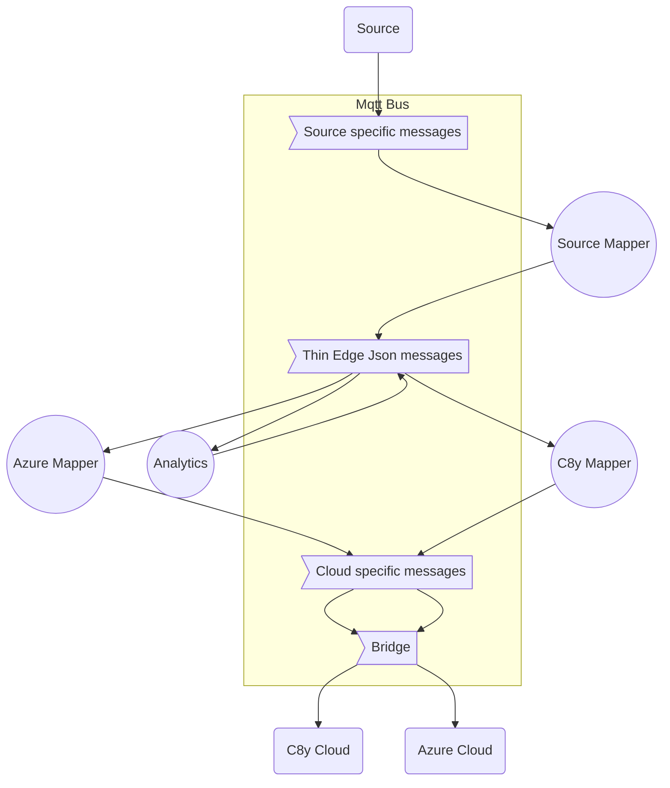

<!-- toc -->

# Sourcing, Processing and Publishing Telemetry Data

Thin-edge.io primary use-case is to:
 
 1. collect telemetry data on a device from various sources, sensors, and child devices,
 2. process these data with analytics components
 3. forward part of the processed to the cloud.
 
 This flow of data is organized over :
 1. an [MQTT bus](./mqtt-bus.md) where the local components publish and exchange messages,
 2. a canonical data format, [thin-edge-json](./thin-edge-json.md), that let the components exchange telemetry data
    independently of the connected cloud
 3. a mapper process that translates canonical messages and forward them to the cloud.

