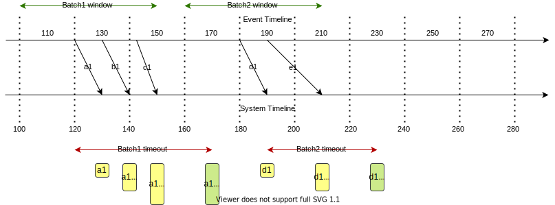
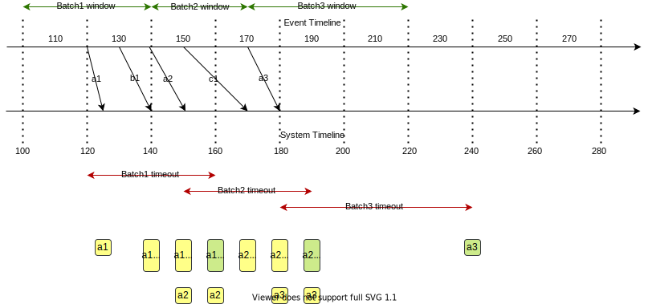
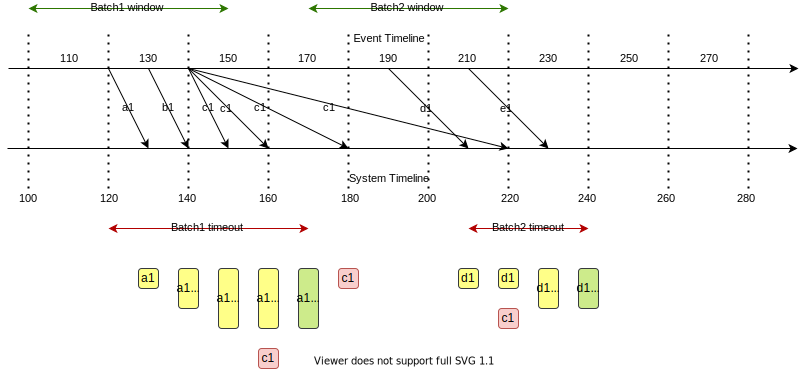
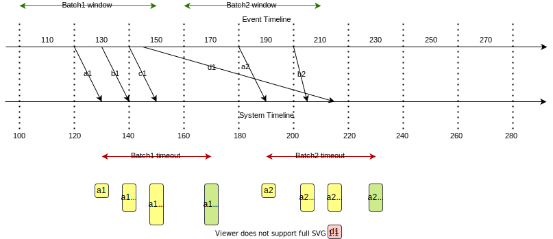

# Message Batching

A deterministic message bacthing algorithm that builds batches based on the timestamp at which the message is generated rather than the timestamp at which the message was received by the batcher.

## Terminology

* **Event time:** The time at which a measurement/event is *generated*
* **Processing time:** The time at which that measurement/event is *received/processed*
* **Max message delay:** The `maximum message delay` is defined as the maximum acceptable delay between the event generation time and the event processing time for a message received by the batch processor. If an event generated at time `t` is received by the batch processor *after* the maximum acceptable delay, it will considered too old and won't be processed further.
* **Batching window:** is defined as the maximum allowed gap between the event timestamps of the first message in a batch and the last message in a batch. It is important to note that the `batching window` is based on the *event timestamps*.
* **Batching timeout:** is the maximum time that the batcher will keep a batch open till the last message arrives after a batch has started. The `batching timeout` can be defined as the `batching window` + `max message delay`
* **Message leap limit** is applied to the "messages from the future" for which the event timestamp is higher than the current processing time. If an event generated at time `t`, received by the batch processor, is more than the maximum acceptable leap limit in future, it will considered as too futuristic and won't be processed further. For example, if the `message leap limit` is defined as 20 and if an event with timestamp `t120` is delivered to the batch processor at `T110`, it will be accepted, as `t120` < `T110 + 20`. But an event with timestamp `t131` would have been rejected as `t131` > `T110 + 20`.
* **Max batch size** is the maximum alloawable size of a batch in bytes (**NOT** just in terms of the number of messages as different messages have different keys of varying size)

## Requirements

* Different measurements generated within a `batching window` must be batched together.
* Different strategies can be applied to define the start of each new batching window. The simplest one would be to start a new window at a regular pace, each just after the previous one. In practice, this would lead to empty batch and and arbitrary cut in the middle of a "logical batch". Hence, we prefer to wait for a first message to start a new batch and (ideally) close that batch on the receipt of the last message from that logical batch.
* The `batching window` helps in limiting the number of messages that get batched up together.
* The `batching timeout` prevents the batcher from waiting forever to receive the last message in a batch after the batch has started on the receipt of the first message.
* The `message leap limit` limits the unbounded growth of batches to accommodate messages from the future.
* The `max batch size` limits the unbounded growth of individual batches.
* While a batch is being built, if a measurement that's already present in the current batch arrives with a different timestamp(meaning it's a different measurement of the same type), the new message and the existing message must be put into two different batches to avoid a conflict.
* If a message in a batch has to be replaced by another message of the same type, it has to be done in a deterministic manner based on their event timestamps. But dropping messages in favour of another one is not preferred, if there isn't a string case for it.
## Assumptions

* There are no assumptions made on the relation between event time and processing time like `t <= T` as it can't be guaranteed due to factors like events coming from external devices with a different clock, leap seconds etc. Because of these limitations, we need to handle the cases where `t <= T` as well as `t > T`.
* Even though MQTT guarantess ordered delivery of message with QoS 0 and 2 and a partial ordering of messages even with QoS 1 with the possibility of duplicates on a single topic, we can't rely on these guarantees as we have to handle messages coming on different topics as well (as in the case of `collectd`) and MQTT doesn't guarantee any order bewteen messages published to different topics. Refer to MQTT ordering guarantees in the MQTT 3.1 specification [here](http://docs.oasis-open.org/mqtt/mqtt/v3.1.1/os/mqtt-v3.1.1-os.html#_Toc398718105) for more details.
* The event timestamps will be compared against each other based on their UTC time representation. If the timestamp carries a different timezone, it will be converted to its equivalent epoch value in UTC.

## Usecases

In the examples defined in the following use-case sections, the `batching window` is fixed as **50** and the `max message delay` is fixed as **20**.
That is, if a message `m1` generated at `t100` is received by the batcher at `T110`, then the batcher will wait till `T170` to group any messages that has an embedded timestamp between `t100` and `t150`.
Messages with event timestamp less than `t100` and greater than `t150` will be out of this batch even if received before the batching timeout at `T170`.
Similarly, `message leap limit` is also fixed as **20**.

The representation `a5:t50@T60` represents the 5th instance of a measurement of type `a` generated with the event timestamp of `t50` received by the batcher at processing time `T60`.

The batch color schemes used in the images in the use-case sections are defined as follows:
* Yellow: Open batch
* Green: Closed batch
* Red: Rejected message(s)
* Blue: Indecisive

### UC1: Simple batching with batching window

Message flow:


Rationale:

* `b1:t120@T125` is the first message that's received by the batcher, which starts a new batch with the batching window `t105-t155` with the batching timeout at `T175`. Batching window is started from `t105` instead of the message's event timestamp `t120` to accommodate delayed messages as well like `a1`.
* `a1:t115@T135` was delivered with a delay, but it is added to the same batch as `b1` as it falls within the batch1 window.
* `c1` gets added to the same batch as they are within the bounds of batch1's batching window.
* `d1:t160@T165` starts a new batch as its event timestamp is outside the first batch's batching window of `t105-155` even though it was received before batch1's batch timeout at `T175`. The first batch is not closed at this point as messages from that batch can arrive till the batching timeout at `T170` and it will be kept open until then. Even though the batching window for batch2 was supposed to start from `t135` based on the event timestamp `t160` of `d1`, the batching window of the second batch starts from the end of batch1 from `t155-t205` to avoid an overlap with batch1.
* `e1:t175@T190` gets added to the second batch itself as it belongs to the batching window of `t155-t205` started by `d2`.
* `g1` starts a third batch
* `f1` is rejected without being added to the third batch or starting a new batch as its event timestamp `t215` is less than the maximum acceptable delay of `t240` when it's delivered at `T260`.


### UC2: Simple batching with batching timeout

Message flow:



Rationale:

* `a1` `b1` and `c1` formed the first batch which got closed with the batching timeout at `T170`
* `d1` and `e1` are arrived after the batching timeout and hence a separate batch was started at `T190`. But since they're both within the same batching window, they're added together into a single batch.

### UC3: Batch split due to conflicting measurements

Message flow:



Rationale:

* `a1:t120@T125` starts a new batch with the batching window `t100-t150` and batching timeout at `T170`
* `b1` gets added to the same batch
* Receipt of `a2:t140@T150` raises a conflict because the measurement `a1` of type `a` already exists in the first batch. To avoid this conflict, a new batch is started by splitting batch1. This second batch is started with a batching window of `t140-t190` with the batching timeout at `T210`. This also results in the first batch's batching window to be reduced from `t100-150` to `t100-t140` with the batching timeout also lowered from `T170 ` to `T160`.
* `c1` gets added to batch2 itself.
* `a3:t170@T180` causes yet another conflict in batch2 and results in a third batch as it can't be added to the second batch either due to the conflict with `a2`. Its batching window would be `t170-t220` with the batch timeout at `T240`. It also results in the shorteing of batch2 with the batching window re-adjusted to `t140-170` with the batching timeout at `T190`.

### UC4: Receiving older already batched messages after starting a new batch

Message flow:



Rationale:

* `a1` `b1` and `c1` formed the first batch which got closed with the batching timeout at `T170`
* When a duplicate of `c1:140` is received at `T160`, it's rejected because it's a duplicate.
* `d1:t190@T210` would trigger the creation of a new batch with the batching window `t170-t220` and a batching timeout at `T240`.
* When a duplicate of `c1:t140` is received at `T220` while building this second batch, it needs to be rejected because it is too old to be fit into the current batch's batching window.

### UC5: Receiving older unbatched messages after starting a new batch

Message flow:



Rationale:

* `a1` `b1` and `c1` formed the first batch which got closed with the batching timeout at `T170`
* `a2:t180@T190` starts a new batch with batching window `t160-t210` and a batching timeout at `T245`. `b2` is also added to the same batch.
* When `d1:t145` is received at `T210`, it can't be added to the first batch as it is already closed, even though its event timestamp `t145` falls within the first batch's batching window from `t100-t150`. It can't be added to the second batch either as it is too old for that batch as well. A third batch can't be created either 

## Design Specification

* Messages are bacthed based on their event timestamps
* A single batch can accommodate messages with event timestamps that falls within a `batching window`
* Multiple bacthes will have to be built parallelly and kept active to accommodate messages having different timestamps that can't be fit into a single batch
* Each batch has a batching window and batching timeout derived from the event timestamp of the first message in that batch. The logic used to derive the batching window is explained below.
* No two batches will have an overlapping batching window
* Each batch is kept active until the current system time is less than or equal to `batch timeout` of that batch.
* An incoming message will be rejected if:
  * Its timestamp is less than `maximum message delay` allowed for a message
  * It is a duplicate of another message that's present in an active batch
  * Its timestamp is greater than the `message leap limit`
* An incoming message will be added to one of the existing bacthes if it meets all the criteria to be added to that batch, otherwise a new batch with a different batching window will be created for this new message. The batching crtiteria are explained in detail below.
* An existing batch will be split to accommodate a new incoming message if:
  * The addition of the new message will cause the target batch size to exceed the `max batch size`
  * The target batch already contains another conflicting message of the same type with a different timestamp (another instance of the same message)

The detailed batching algorithm is as follows:

```
On message receipt {
    `current event time` = event timestamp of the message converted to epoch value in UTC
    if `current event time` < `current system time` - `max message delay` {
        reject this message as it's too old
    } else if `current event time` > `current system time` + `message leap limit` {
        reject this message as too futuristic
    } else {
        if event timestamp fits into the batching window range of any of the active bacthes {
            pick that batch as the `target batch`
            if another conflicting message of the same type is present in the target batch {
                if event timestamp is equal to the conflicting measurement's timestamp {
                    ignore the current message as duplicate
                } else {
                    split the target batch into two, in such a way that the current message and the conflicting message are in different batches
                }
            } else {
                if `target batch size` + `current message size` < `max batch size` {
                    add this message to the target batch
                } else {
                    split the target batch into two from the point of the current message's timestamp where:
                }
            }
        } else {
            start a new batch with a new batching window where:
            if there are no active batches with a `batch end time` < `current event time` {
                `batch start time` = `current event processing time` - `max message delay`
            } else {
                target batch = the nearest active batch for which `batch end time` < `current event time`
                `batch start time` = max((`current event processing time` - `max message delay`), target batch's `batch end time`)
            }
            if there are no active batches with a `batch start time` > `current event time` {
                `batch end time` = `batch start time` + `default batching window size`
            } else {
                target batch = the nearest active batch for which `batch start time` > `current event time`
                `batch end time` = min(`batch start time` + `default batching window size`, target batch's `batch window start time`)
            }
            batch timeout = `batch end time` + `max message delay`
        }
    }
}
```
